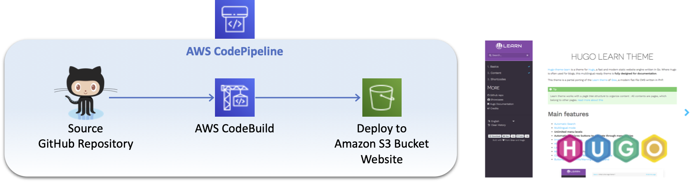
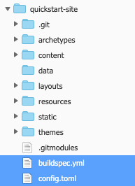
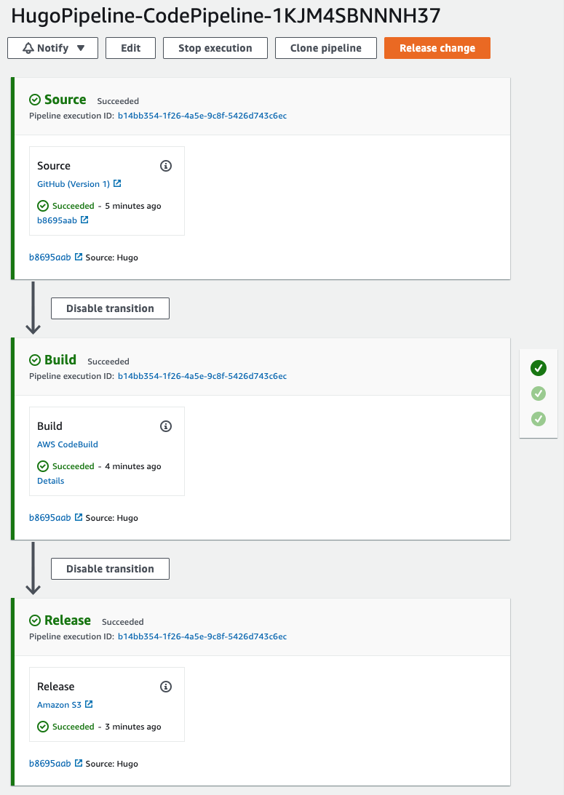
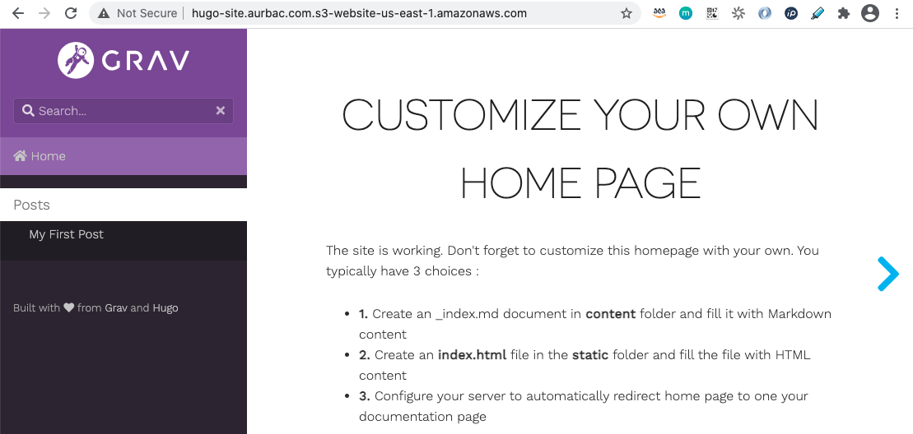

# AWS CodePipeline to Deploy Hugo site from GitHub to Amazon S3 Bucket



## Create a personal access token for GitHub

You need a personal access token for GitHub and must have the following scopes.

* **repo**: Grants full control of private repositories.
* **repo:status**: Grants access to commit statuses.
* **admin:repo_hook**: Grants full control of repository hooks. This scope is not required if your token has the repo scope.

https://help.github.com/en/articles/creating-a-personal-access-token-for-the-command-line

## Create you first Hugo site

Install [Hugo](https://gohugo.io/) using [Homebrew](https://brew.sh/).

``` bash
brew install hugo
```

Create a quickstart site.

``` bash
hugo new site quickstart-site
cd quickstart-site
```

Add the theme [Hugo Learn Theme](https://github.com/matcornic/hugo-theme-learn) as Git submodule.

``` bash
git init
git submodule add https://github.com/matcornic/hugo-theme-learn.git themes/hugo-theme-learn
```

Append the following line to your site's **config.toml**.

``` yml
theme = "hugo-theme-learn"
```

Create a new **buildspec.yml** file inside your Hugo site with the following lines.

``` yml
version: 0.2
phases:
  install:
    runtime-versions:
      python: 3.8
    commands:
      - apt-get update
      - echo Installing hugo
      - curl -L -o hugo.deb https://github.com/gohugoio/hugo/releases/download/v0.70.0/hugo_0.70.0_Linux-64bit.deb
      - dpkg -i hugo.deb
      - hugo version
      - rm .gitmodules
      - rm -rf themes/hugo-theme-learn
  pre_build:
    commands:
      - git init
      - git submodule add https://github.com/matcornic/hugo-theme-learn.git themes/hugo-theme-learn
  build:
    commands:
      # Build
      - hugo -v
      - ls -la
      - ls themes/hugo-theme-learn -la
  post_build:
    commands:
      # Post Build

artifacts:
  base-directory: 'public'
  files:
    - '**/*'
```

Add some content to the site

``` bash
hugo new posts/my-first-post.md
```

Edit the newly created content file header of the post to say `draft: false`.

```
---
title: "My First Post"
date: 2021-01-09T01:31:32Z
draft: false
---
```

Your Hugo site files looks similar to.



Now create a new GitHub repository for your Hugo site and push the changes.

## Create the CodePipeline to deploy changes automatically to your Amazon S3 Website

Download the CloudFormation template [AURBAC-hugo-codepipeline-github-to-s3.json](AURBAC-hugo-codepipeline-github-to-s3.json) and launch in your selected region to create the AWS CodePipeline and an Amazon S3 Bucket for your WebSite, specify the following values:

* GitHubRepo (Repository name)
* GitHubBranch
* GitHubOwner (Github User)
* GitHubOAuthToken
* WebsiteDomain (Bucket name)

Wait until stack status is **CREATE_COMPLETE** and go to the AWS CodePipeline console, automatically the pipeline release a change and deploy to your Amazon S3 Bucket.



In the **Outputs** of your CloudFormation Stack you will find the link to your Website.

